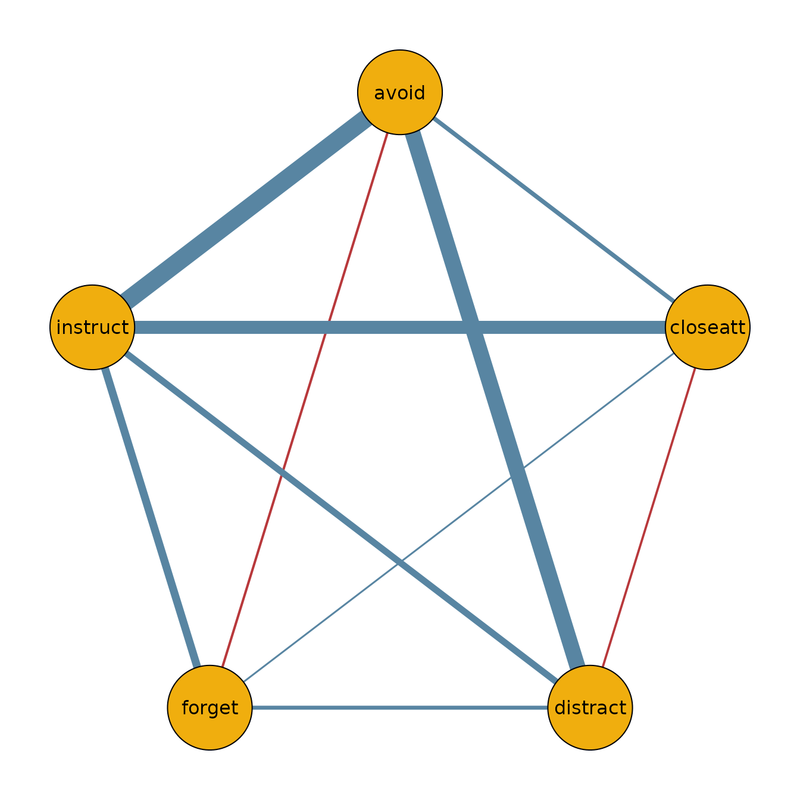

# Model Comparison with bgmCompare

## Introduction

The function
[`bgmCompare()`](https://bayesian-graphical-modelling-lab.github.io/bgms/reference/bgmCompare.md)
extends
[`bgm()`](https://bayesian-graphical-modelling-lab.github.io/bgms/reference/bgm.md)
to independent-sample designs. It estimates whether edge weights and
category thresholds differ across groups in an ordinal Markov random
field (MRF).

Posterior inclusion probabilities indicate how plausible it is that a
group difference exists in a given parameter. These can be converted to
Bayes factors for hypothesis testing.

## ADHD dataset

We illustrate with a subset from the `ADHD` dataset included in
**bgms**.

``` r
library(bgms)

?ADHD
data_adhd = ADHD[ADHD$group == 1, -1]
data_adhd = data_adhd[, 1:5]
data_no_adhd = ADHD[ADHD$group == 0, -1]
data_no_adhd = data_no_adhd[, 1:5]
```

## Fitting a model

``` r
fit = bgmCompare(x = data_adhd, y = data_no_adhd, seed = 1234)
```

## Posterior summaries

The summary shows both baseline effects and group differences:

``` r
summary(fit)
#> Posterior summaries from Bayesian grouped MRF estimation (bgmCompare):
#> 
#> Category thresholds:
#>      parameter   mean  mcse    sd    n_eff  Rhat
#> 1    avoid (1) -2.652 0.007 0.393 2838.525 1.001
#> 2 closeatt (1) -2.258 0.007 0.376 3139.100 1.000
#> 3 distract (1) -0.496 0.007 0.316 2117.341 1.002
#> 4   forget (1) -1.589 0.006 0.326 2621.001 1.001
#> 5 instruct (1) -2.432 0.008 0.374 2215.373 1.002
#> 
#> Pairwise interactions:
#>           parameter   mean  mcse    sd    n_eff  Rhat
#> 1    avoid-closeatt  0.965 0.012 0.456 1438.106 1.005
#> 2    avoid-distract  1.693 0.007 0.353 2930.081 1.001
#> 3      avoid-forget  0.495 0.009 0.384 1797.217 1.003
#> 4    avoid-instruct  0.397 0.010 0.455 2226.350 1.004
#> 5 closeatt-distract -0.252 0.007 0.397 2822.267 1.000
#> 6   closeatt-forget  0.143 0.006 0.310 3090.678 1.002
#> ... (use `summary(fit)$pairwise` to see full output)
#> 
#> Inclusion probabilities:
#>                  parameter  mean    sd  mcse n0->0 n0->1 n1->0 n1->1
#>               avoid (main) 1.000 0.000           0     0     0  3999
#>  avoid-closeatt (pairwise) 0.794 0.404 0.012   535   289   288  2887
#>  avoid-distract (pairwise) 0.406 0.491 0.008  1486   888   889   736
#>    avoid-forget (pairwise) 0.841 0.365 0.011   402   233   232  3132
#>  avoid-instruct (pairwise) 0.988 0.109 0.004    31    17    17  3934
#>            closeatt (main) 1.000 0.000           0     0     0  3999
#>     n_eff  Rhat
#>                
#>  1132.933 1.014
#>   3415.16     1
#>  1114.745 1.005
#>     873.5 1.069
#>                
#> ... (use `summary(fit)$indicator` to see full output)
#> Note: NA values are suppressed in the print table. They occur when an indicator
#> was constant (all 0 or all 1) across all iterations, so sd/mcse/n_eff/Rhat
#> are undefined; `summary(fit)$indicator` still contains the NA values.
#> 
#> Group differences (main effects):
#>            parameter   mean    sd mcse n_eff  Rhat
#>     avoid (diff1; 1) -2.552 0.746            1.000
#>  closeatt (diff1; 1) -2.980 0.733            1.002
#>  distract (diff1; 1) -2.525 0.642            1.001
#>    forget (diff1; 1) -2.826 0.664            1.000
#>  instruct (diff1; 1) -2.325 0.861            1.001
#> Note: NA values are suppressed in the print table. They occur here when an
#> indicator was zero across all iterations, so mcse/n_eff/Rhat are undefined;
#> `summary(fit)$main_diff` still contains the NA values.
#> 
#> Group differences (pairwise effects):
#>                  parameter   mean    sd  mcse    n_eff  Rhat
#>     avoid-closeatt (diff1)  1.242 0.907 0.023 1497.972 1.007
#>     avoid-distract (diff1)  0.225 0.367 0.008 2038.950 1.001
#>       avoid-forget (diff1)  1.269 0.817 0.020 1594.521 1.004
#>     avoid-instruct (diff1) -2.743 0.992 0.024 1716.671 1.003
#>  closeatt-distract (diff1) -0.184 0.353 0.008 1833.834 1.000
#>    closeatt-forget (diff1)  0.160 0.320 0.009 1265.097 1.002
#> ... (use `summary(fit)$pairwise_diff` to see full output)
#> Note: NA values are suppressed in the print table. They occur here when an
#> indicator was zero across all iterations, so mcse/n_eff/Rhat are undefined;
#> `summary(fit)$pairwise_diff` still contains the NA values.
#> 
#> Use `summary(fit)$<component>` to access full results.
#> See the `easybgm` package for other summary and plotting tools.
```

You can extract posterior means and inclusion probabilities:

``` r
coef(fit)
#> $main_effects_raw
#>                baseline     diff1
#> avoid(c1)    -2.6519010 -2.552031
#> closeatt(c1) -2.2580927 -2.980312
#> distract(c1) -0.4957581 -2.524521
#> forget(c1)   -1.5890157 -2.826021
#> instruct(c1) -2.4321107 -2.325337
#> 
#> $pairwise_effects_raw
#>                     baseline      diff1
#> avoid-closeatt     0.9652965  1.2424158
#> avoid-distract     1.6926659  0.2247702
#> avoid-forget       0.4952467  1.2689214
#> avoid-instruct     0.3971079 -2.7426345
#> closeatt-distract -0.2521829 -0.1835933
#> closeatt-forget    0.1425580  0.1596400
#> closeatt-instruct  1.5642360  0.5923538
#> distract-forget    0.4036371  0.2192210
#> distract-instruct  1.2730105  1.2178521
#> forget-instruct    1.1264064  0.8077411
#> 
#> $main_effects_groups
#>                  group1    group2
#> avoid(c1)    -1.3758853 -3.927917
#> closeatt(c1) -0.7679368 -3.748249
#> distract(c1)  0.7665024 -1.758019
#> forget(c1)   -0.1760053 -3.002026
#> instruct(c1) -1.2694422 -3.594779
#> 
#> $pairwise_effects_groups
#>                        group1     group2
#> avoid-closeatt     0.34408863  1.5865044
#> avoid-distract     1.58028076  1.8050510
#> avoid-forget      -0.13921404  1.1297074
#> avoid-instruct     1.76842516 -0.9742094
#> closeatt-distract -0.16038624 -0.3439795
#> closeatt-forget    0.06273804  0.2223781
#> closeatt-instruct  1.26805907  1.8604129
#> distract-forget    0.29402657  0.5132476
#> distract-instruct  0.66408446  1.8819366
#> forget-instruct    0.72253590  1.5302770
#> 
#> $indicators
#>            avoid closeatt distract  forget instruct
#> avoid    1.00000  0.79400  0.40625 0.84125  0.98800
#> closeatt 0.79400  1.00000  0.38775 0.37100  0.58625
#> distract 0.40625  0.38775  1.00000 0.39675  0.83975
#> forget   0.84125  0.37100  0.39675 1.00000  0.72650
#> instruct 0.98800  0.58625  0.83975 0.72650  1.00000
```

## Visualizing group networks

We can use the output to plot the network for the ADHD group:

``` r
library(qgraph)

adhd_network = matrix(0, 5, 5)
adhd_network[lower.tri(adhd_network)] = coef(fit)$pairwise_effects_groups[, 1]
adhd_network = adhd_network + t(adhd_network)
colnames(adhd_network) = colnames(data_adhd)
rownames(adhd_network) = colnames(data_adhd)

qgraph(adhd_network,
  theme = "TeamFortress",
  maximum = 1,
  fade = FALSE,
  color = c("#f0ae0e"), vsize = 10, repulsion = .9,
  label.cex = 1, label.scale = "FALSE",
  labels = colnames(data_adhd)
)
```



## Next steps

- For a one-sample analysis, see the *Getting Started* vignette.
- For diagnostics and convergence checks, see the *Diagnostics*
  vignette.
- For additional analysis tools and more advanced plotting options,
  consider using the **easybgm** package, which integrates smoothly with
  **bgms** objects.
