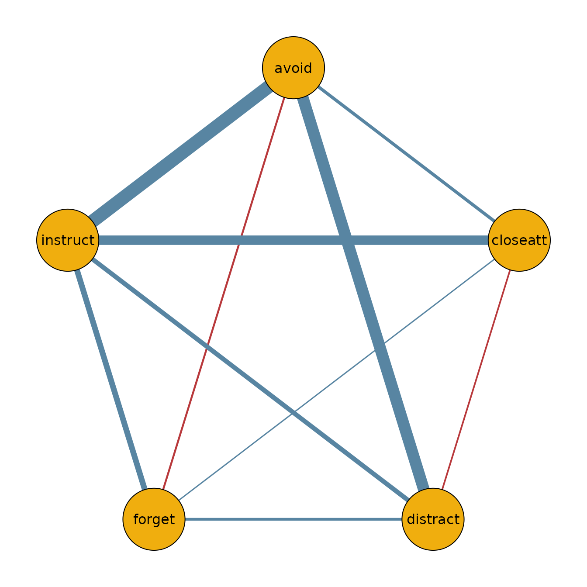

# Model Comparison with bgmCompare

## Introduction

The function
[`bgmCompare()`](https://bayesian-graphical-modelling-lab.github.io/bgms/reference/bgmCompare.md)
extends
[`bgm()`](https://bayesian-graphical-modelling-lab.github.io/bgms/reference/bgm.md)
to independent-sample designs. It estimates whether edge weights and
category thresholds differ across groups in an ordinal Markov random
field (MRF).

Posterior inclusion probabilities indicate how plausible it is that a
group difference exists in a given parameter. These can be converted to
Bayes factors for hypothesis testing.

## ADHD dataset

We illustrate with a subset from the `ADHD` dataset included in
**bgms**.

``` r
library(bgms)

?ADHD
data_adhd = ADHD[ADHD$group == 1, -1]
data_adhd = data_adhd[, 1:5]
data_no_adhd = ADHD[ADHD$group == 0, -1]
data_no_adhd = data_no_adhd[, 1:5]
```

## Fitting a model

``` r
fit = bgmCompare(x = data_adhd, y = data_no_adhd, seed = 1234)
```

## Posterior summaries

The summary shows both baseline effects and group differences:

``` r
summary(fit)
#> Posterior summaries from Bayesian grouped MRF estimation (bgmCompare):
#> 
#> Category thresholds:
#>      parameter   mean  mcse    sd    n_eff  Rhat
#> 1    avoid (1) -2.673 0.012 0.385 1023.798 1.004
#> 2 closeatt (1) -2.284 0.013 0.385  935.513 1.003
#> 3 distract (1) -0.501 0.014 0.338  592.787 1.001
#> 4   forget (1) -1.597 0.012 0.336  842.167 1.001
#> 5 instruct (1) -2.441 0.015 0.409  754.774 1.000
#> 
#> Pairwise interactions:
#>           parameter   mean  mcse    sd    n_eff  Rhat
#> 1    avoid-closeatt  0.974 0.019 0.464  597.805 1.002
#> 2    avoid-distract  1.701 0.011 0.371 1113.512 1.009
#> 3      avoid-forget  0.517 0.014 0.383  771.620 1.003
#> 4    avoid-instruct  0.369 0.019 0.479  637.189 1.002
#> 5 closeatt-distract -0.240 0.012 0.403 1044.191 1.000
#> 6   closeatt-forget  0.142 0.008 0.307 1619.760 1.005
#> ... (use `summary(fit)$pairwise` to see full output)
#> 
#> Inclusion probabilities:
#>                  parameter  mean    sd  mcse n0->0 n0->1 n1->0 n1->1
#>               avoid (main) 1.000 0.000           0     0     0  1999
#>  avoid-closeatt (pairwise) 0.791 0.406 0.016   258   158   159  1424
#>  avoid-distract (pairwise) 0.414 0.493 0.012   721   451   450   377
#>    avoid-forget (pairwise) 0.836 0.370 0.016   211   117   117  1554
#>  avoid-instruct (pairwise) 0.992 0.092 0.003     6    11    11  1971
#>            closeatt (main) 1.000 0.000           0     0     0  1999
#>     n_eff  Rhat
#>                
#>   632.012     1
#>  1734.645     1
#>   542.468 1.014
#>     968.7 1.001
#>                
#> ... (use `summary(fit)$indicator` to see full output)
#> Note: NA values are suppressed in the print table. They occur when an indicator
#> was constant (all 0 or all 1) across all iterations, so sd/mcse/n_eff/Rhat
#> are undefined; `summary(fit)$indicator` still contains the NA values.
#> 
#> Group differences (main effects):
#>            parameter   mean    sd mcse n_eff  Rhat
#>     avoid (diff1; 1) -2.553 0.755            1.000
#>  closeatt (diff1; 1) -2.943 0.767            1.000
#>  distract (diff1; 1) -2.509 0.679            1.001
#>    forget (diff1; 1) -2.815 0.631            1.000
#>  instruct (diff1; 1) -2.309 0.886            1.001
#> Note: NA values are suppressed in the print table. They occur here when an
#> indicator was zero across all iterations, so mcse/n_eff/Rhat are undefined;
#> `summary(fit)$main_diff` still contains the NA values.
#> 
#> Group differences (pairwise effects):
#>                  parameter   mean    sd  mcse   n_eff  Rhat
#>     avoid-closeatt (diff1)  1.247 0.933 0.035 714.099 1.000
#>     avoid-distract (diff1)  0.237 0.381 0.014 792.184 1.003
#>       avoid-forget (diff1)  1.275 0.833 0.032 690.595 1.005
#>     avoid-instruct (diff1) -2.823 1.063 0.040 698.748 1.003
#>  closeatt-distract (diff1) -0.201 0.377 0.014 775.540 1.000
#>    closeatt-forget (diff1)  0.158 0.317 0.012 669.013 1.001
#> ... (use `summary(fit)$pairwise_diff` to see full output)
#> Note: NA values are suppressed in the print table. They occur here when an
#> indicator was zero across all iterations, so mcse/n_eff/Rhat are undefined;
#> `summary(fit)$pairwise_diff` still contains the NA values.
#> 
#> Use `summary(fit)$<component>` to access full results.
#> See the `easybgm` package for other summary and plotting tools.
```

You can extract posterior means and inclusion probabilities:

``` r
coef(fit)
#> $main_effects_raw
#>                baseline     diff1
#> avoid(c1)    -2.6733105 -2.553451
#> closeatt(c1) -2.2835389 -2.943054
#> distract(c1) -0.5006563 -2.509204
#> forget(c1)   -1.5968941 -2.815041
#> instruct(c1) -2.4409182 -2.308513
#> 
#> $pairwise_effects_raw
#>                     baseline      diff1
#> avoid-closeatt     0.9738010  1.2471095
#> avoid-distract     1.7008360  0.2371564
#> avoid-forget       0.5167956  1.2745682
#> avoid-instruct     0.3687844 -2.8232097
#> closeatt-distract -0.2396321 -0.2008362
#> closeatt-forget    0.1422782  0.1584187
#> closeatt-instruct  1.5800887  0.5921918
#> distract-forget    0.3991395  0.2171669
#> distract-instruct  1.2773806  1.2261510
#> forget-instruct    1.1200883  0.7827291
#> 
#> $main_effects_groups
#>                  group1    group2
#> avoid(c1)    -1.3965849 -3.950036
#> closeatt(c1) -0.8120119 -3.755066
#> distract(c1)  0.7539455 -1.755258
#> forget(c1)   -0.1893738 -3.004415
#> instruct(c1) -1.2866618 -3.595174
#> 
#> $pairwise_effects_groups
#>                        group1     group2
#> avoid-closeatt     0.35024627  1.5973558
#> avoid-distract     1.58225786  1.8194142
#> avoid-forget      -0.12048853  1.1540797
#> avoid-instruct     1.78038927 -1.0428204
#> closeatt-distract -0.13921402 -0.3400502
#> closeatt-forget    0.06306886  0.2214876
#> closeatt-instruct  1.28399280  1.8761846
#> distract-forget    0.29055604  0.5077229
#> distract-instruct  0.66430508  1.8904561
#> forget-instruct    0.72872378  1.5114529
#> 
#> $indicators
#>           avoid closeatt distract forget instruct
#> avoid    1.0000   0.7915   0.4140 0.8360   0.9915
#> closeatt 0.7915   1.0000   0.3950 0.3755   0.5855
#> distract 0.4140   0.3950   1.0000 0.4065   0.8450
#> forget   0.8360   0.3755   0.4065 1.0000   0.7165
#> instruct 0.9915   0.5855   0.8450 0.7165   1.0000
```

## Visualizing group networks

We can use the output to plot the network for the ADHD group:

``` r
library(qgraph)

adhd_network = matrix(0, 5, 5)
adhd_network[lower.tri(adhd_network)] = coef(fit)$pairwise_effects_groups[, 1]
adhd_network = adhd_network + t(adhd_network)
colnames(adhd_network) = colnames(data_adhd)
rownames(adhd_network) = colnames(data_adhd)

qgraph(adhd_network,
  theme = "TeamFortress",
  maximum = 1,
  fade = FALSE,
  color = c("#f0ae0e"), vsize = 10, repulsion = .9,
  label.cex = 1, label.scale = "FALSE",
  labels = colnames(data_adhd)
)
```



## Next steps

- For a one-sample analysis, see the *Getting Started* vignette.
- For diagnostics and convergence checks, see the *Diagnostics*
  vignette.
- For additional analysis tools and more advanced plotting options,
  consider using the **easybgm** package, which integrates smoothly with
  **bgms** objects.
