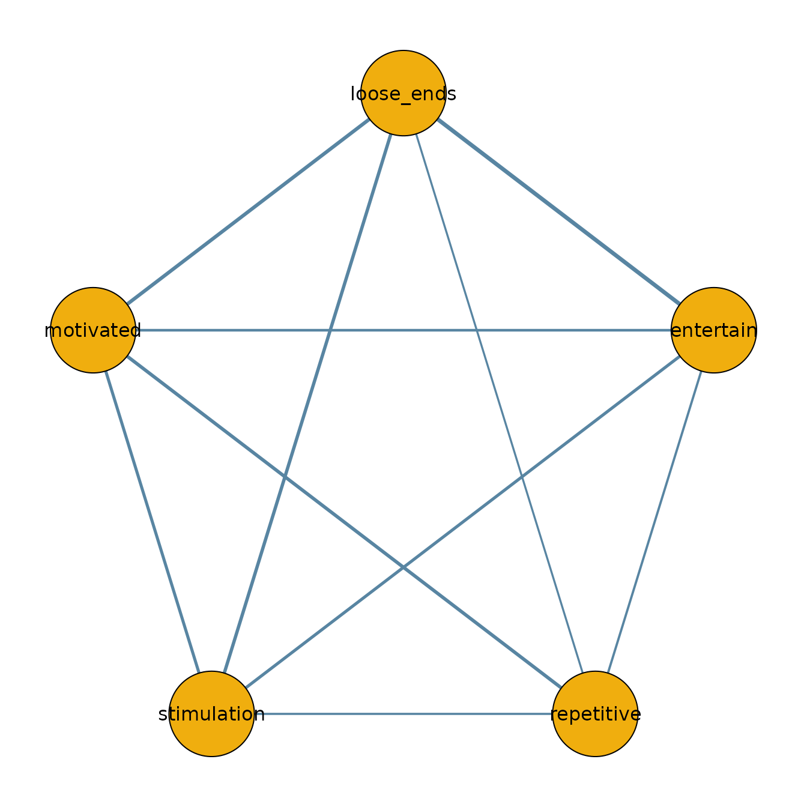

# Model Comparison with bgmCompare

## Introduction

The function
[`bgmCompare()`](https://bayesian-graphical-modelling-lab.github.io/bgms/reference/bgmCompare.md)
extends
[`bgm()`](https://bayesian-graphical-modelling-lab.github.io/bgms/reference/bgm.md)
to independent-sample designs. It estimates whether edge weights and
category thresholds differ across groups in an ordinal Markov random
field (MRF).

Posterior inclusion probabilities indicate how plausible it is that a
group difference exists in a given parameter. These can be converted to
Bayes factors for hypothesis testing.

## ADHD dataset

We illustrate with a subset from the `ADHD` dataset included in
**bgms**.

``` r
library(bgms)

?ADHD
data_adhd = ADHD[ADHD$group == 1, -1]
data_adhd = data_adhd[, 1:5]
data_no_adhd = ADHD[ADHD$group == 0, -1]
data_no_adhd = data_no_adhd[, 1:5]
```

## Fitting a model

``` r
fit = bgmCompare(x = data_adhd, y = data_no_adhd, seed = 1234)
```

## Posterior summaries

The summary shows both baseline effects and group differences:

``` r
summary(fit)
#> Posterior summaries from Bayesian grouped MRF estimation (bgmCompare):
#> 
#> Category thresholds:
#>      parameter   mean  mcse    sd    n_eff  Rhat
#> 1    avoid (1) -2.650 0.007 0.389 3559.494 1.002
#> 2 closeatt (1) -2.256 0.006 0.378 3882.469 1.001
#> 3 distract (1) -0.489 0.007 0.318 2170.180 1.002
#> 4   forget (1) -1.594 0.005 0.326 3520.164 1.000
#> 5 instruct (1) -2.441 0.007 0.387 2783.026 1.001
#> 
#> Pairwise interactions:
#>           parameter   mean  mcse    sd    n_eff  Rhat
#> 1    avoid-closeatt  0.969 0.010 0.457 2097.595 1.003
#> 2    avoid-distract  1.683 0.006 0.348 3981.377 1.001
#> 3      avoid-forget  0.519 0.008 0.378 2059.110 1.001
#> 4    avoid-instruct  0.365 0.009 0.473 2836.978 1.001
#> 5 closeatt-distract -0.257 0.007 0.397 3546.833 1.001
#> 6   closeatt-forget  0.135 0.004 0.289 4145.657 1.001
#> ... (use `summary(fit)$pairwise` to see full output)
#> 
#> Inclusion probabilities:
#>                  parameter  mean    sd  mcse n0->0 n0->1 n1->0 n1->1
#>               avoid (main) 1.000 0.000           0     0     0  3999
#>  avoid-closeatt (pairwise) 0.787 0.409 0.012   545   307   307  2840
#>  avoid-distract (pairwise) 0.403 0.490 0.009  1535   854   853   757
#>    avoid-forget (pairwise) 0.861 0.346  0.01   347   209   209  3234
#>  avoid-instruct (pairwise) 0.992 0.089 0.002    16    16    16  3951
#>            closeatt (main) 1.000 0.000           0     0     0  3999
#>     n_eff  Rhat
#>                
#>   1187.67 1.003
#>  3189.624     1
#>   1117.06 1.008
#>  1347.713 1.015
#>                
#> ... (use `summary(fit)$indicator` to see full output)
#> Note: NA values are suppressed in the print table. They occur when an indicator
#> was constant (all 0 or all 1) across all iterations, so sd/mcse/n_eff/Rhat
#> are undefined; `summary(fit)$indicator` still contains the NA values.
#> 
#> Group differences (main effects):
#>            parameter   mean    sd mcse n_eff  Rhat
#>     avoid (diff1; 1) -2.559 0.746            1.001
#>  closeatt (diff1; 1) -2.973 0.743            1.000
#>  distract (diff1; 1) -2.529 0.646            1.001
#>    forget (diff1; 1) -2.820 0.645            1.000
#>  instruct (diff1; 1) -2.329 0.883            1.000
#> Note: NA values are suppressed in the print table. They occur here when an
#> indicator was zero across all iterations, so mcse/n_eff/Rhat are undefined;
#> `summary(fit)$main_diff` still contains the NA values.
#> 
#> Group differences (pairwise effects):
#>                  parameter   mean    sd  mcse    n_eff  Rhat
#>     avoid-closeatt (diff1)  1.242 0.924 0.022 1715.171 1.002
#>     avoid-distract (diff1)  0.229 0.373 0.008 2230.567 1.000
#>       avoid-forget (diff1)  1.314 0.803 0.019 1741.251 1.002
#>     avoid-instruct (diff1) -2.829 1.026 0.021 2458.550 1.000
#>  closeatt-distract (diff1) -0.197 0.375 0.008 2042.893 1.000
#>    closeatt-forget (diff1)  0.145 0.294 0.007 1869.265 1.001
#> ... (use `summary(fit)$pairwise_diff` to see full output)
#> Note: NA values are suppressed in the print table. They occur here when an
#> indicator was zero across all iterations, so mcse/n_eff/Rhat are undefined;
#> `summary(fit)$pairwise_diff` still contains the NA values.
#> 
#> Use `summary(fit)$<component>` to access full results.
#> See the `easybgm` package for other summary and plotting tools.
```

You can extract posterior means and inclusion probabilities:

``` r
coef(fit)
#> $main_effects_raw
#>                baseline     diff1
#> avoid(c1)    -2.6496279 -2.559199
#> closeatt(c1) -2.2564976 -2.973389
#> distract(c1) -0.4891458 -2.528601
#> forget(c1)   -1.5940241 -2.819869
#> instruct(c1) -2.4411226 -2.328812
#> 
#> $pairwise_effects_raw
#>                     baseline      diff1
#> avoid-closeatt     0.9686767  1.2421037
#> avoid-distract     1.6833280  0.2291975
#> avoid-forget       0.5188468  1.3144551
#> avoid-instruct     0.3650809 -2.8294976
#> closeatt-distract -0.2568626 -0.1968535
#> closeatt-forget    0.1351339  0.1445951
#> closeatt-instruct  1.5831776  0.6264731
#> distract-forget    0.4037733  0.2104372
#> distract-instruct  1.2831076  1.2310124
#> forget-instruct    1.1186894  0.7977383
#> 
#> $main_effects_groups
#>                  group1    group2
#> avoid(c1)    -1.3700285 -3.929227
#> closeatt(c1) -0.7698032 -3.743192
#> distract(c1)  0.7751545 -1.753446
#> forget(c1)   -0.1840897 -3.003958
#> instruct(c1) -1.2767166 -3.605529
#> 
#> $pairwise_effects_groups
#>                       group1     group2
#> avoid-closeatt     0.3476249  1.5897286
#> avoid-distract     1.5687292  1.7979267
#> avoid-forget      -0.1383807  1.1760744
#> avoid-instruct     1.7798297 -1.0496680
#> closeatt-distract -0.1584358 -0.3552893
#> closeatt-forget    0.0628363  0.2074314
#> closeatt-instruct  1.2699410  1.8964141
#> distract-forget    0.2985548  0.5089919
#> distract-instruct  0.6676014  1.8986137
#> forget-instruct    0.7198202  1.5175585
#> 
#> $indicators
#>            avoid closeatt distract  forget instruct
#> avoid    1.00000  0.78700  0.40275 0.86100  0.99200
#> closeatt 0.78700  1.00000  0.38050 0.35900  0.61275
#> distract 0.40275  0.38050  1.00000 0.39375  0.83850
#> forget   0.86100  0.35900  0.39375 1.00000  0.71975
#> instruct 0.99200  0.61275  0.83850 0.71975  1.00000
```

## Visualizing group networks

We can use the output to plot the network for the ADHD group:

``` r
library(qgraph)

adhd_network = matrix(0, 5, 5)
adhd_network[lower.tri(adhd_network)] = coef(fit)$pairwise_effects_groups[, 1]
adhd_network = adhd_network + t(adhd_network)
colnames(adhd_network) = colnames(data_adhd)
rownames(adhd_network) = colnames(data_adhd)

qgraph(adhd_network,
  theme = "TeamFortress",
  maximum = 1,
  fade = FALSE,
  color = c("#f0ae0e"), vsize = 10, repulsion = .9,
  label.cex = 1, label.scale = "FALSE",
  labels = colnames(data_adhd)
)
```



## Next steps

- For a one-sample analysis, see the *Getting Started* vignette.
- For diagnostics and convergence checks, see the *Diagnostics*
  vignette.
- For additional analysis tools and more advanced plotting options,
  consider using the **easybgm** package, which integrates smoothly with
  **bgms** objects.
