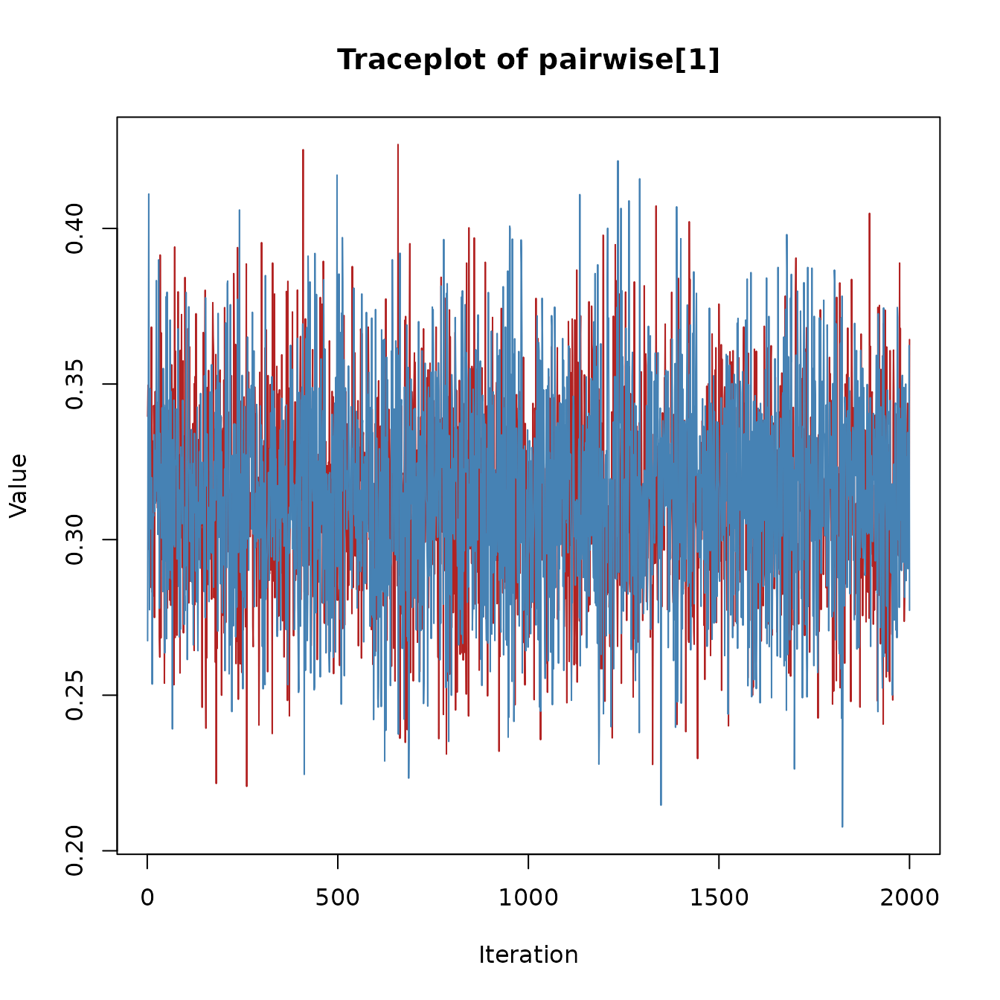

# Diagnostics and Spike-and-Slab Summaries

## Introduction

This vignette illustrates how to inspect convergence diagnostics and how
to interpret spike-and-slab summaries in **bgms** models. For some of
the model variables spike-and-slab priors introduce binary indicator
variables that govern whether the effect is included or not. Their
posterior distributions can be summarized with inclusion probabilities
and Bayes factors.

## Example fit

We use a subset of the Wenchuan dataset:

``` r

library(bgms)
data = Wenchuan[, 1:5]
fit = bgm(data, seed = 1234)
```

## Convergence diagnostics

The quality of the Markov chain can be assessed with common MCMC
diagnostics:

``` r

summary(fit)$pairwise
#>                          mean         mcse          sd     n_eff
#> intrusion-dreams  0.314597339 0.0004724276 0.032071568 4608.6100
#> intrusion-flash   0.167979157 0.0004795802 0.030636817 4080.9826
#> intrusion-upset   0.101166857 0.0010565260 0.029537560 2306.8293
#> intrusion-physior 0.100400771 0.0011706804 0.029132639 2356.7184
#> dreams-flash      0.249691205 0.0004189190 0.029250717 4875.4303
#> dreams-upset      0.113681735 0.0004639335 0.026520228 3267.7060
#> dreams-physior    0.001427240 0.0003222443 0.007602201  685.2307
#> flash-upset       0.003241342 0.0005133673 0.012050155  540.1347
#> flash-physior     0.153388799 0.0003755116 0.026167520 4855.9966
#> upset-physior     0.354214108 0.0005267256 0.030380058 3326.6594
#>                   n_eff_mixt      Rhat
#> intrusion-dreams          NA 1.0028297
#> intrusion-flash           NA 0.9999015
#> intrusion-upset     781.6078 1.0067459
#> intrusion-physior   619.2741 1.0154938
#> dreams-flash              NA 0.9997637
#> dreams-upset              NA 1.0030275
#> dreams-physior      556.5552 1.0072328
#> flash-upset         550.9712 1.0082317
#> flash-physior             NA 1.0014046
#> upset-physior             NA 1.0008526
```

- R-hat values close to 1 (typically below 1.01) suggest convergence
  ([Vehtari et al., 2021](#ref-VehtariEtAl_2021)).
- The effective sample size (ESS) reflects the number of independent
  samples that would provide equivalent precision. Larger ESS values
  indicate more reliable estimates.
- The Monte Carlo standard error (MCSE) measures the additional
  variability introduced by using a finite number of MCMC draws. A small
  MCSE relative to the posterior standard deviation indicates stable
  estimates, whereas a large MCSE suggests that more samples are needed.

### Two ESS measures for edge-selected parameters

With edge or difference selection active, the effect parameters are
governed by spike-and-slab priors. The corresponding parameter is set to
exactly zero when the effect is excluded, rather than being removed from
the model. Because the parameter has a well-defined value at every
iteration, the full chain — including zeros — is a valid sequence for
computing ESS.

- **n_eff** is the unconditional ESS, computed from the full effect
  chain. It measures how precisely the overall posterior mean is
  estimated.
- **n_eff_mixt** is the mixture ESS. It measures how precisely the
  posterior mean of the effect is estimated while accounting for the
  additional uncertainty introduced by the spike-and-slab selection.
  When the indicator rarely switches between inclusion and exclusion
  (fewer than 5 transitions), `n_eff_mixt` is suppressed in the printed
  output.

### Traceplots

Users can inspect traceplots by extracting raw samples directly. Here is
an example for the pairwise effect parameter.

``` r

param_index = 1
chains = fit$raw_samples$pairwise
nchains = length(chains)
cols = c("firebrick", "steelblue", "darkgreen", "goldenrod")

plot(chains[[1]][, param_index],
  type = "l", col = cols[1],
  xlab = "Iteration", ylab = "Value",
  main = "Traceplot of pairwise[1]",
  ylim = range(sapply(chains, function(ch) range(ch[, param_index])))
)
if(nchains > 1) {
  for(c in 2:nchains) {
    lines(chains[[c]][, param_index], col = cols[c])
  }
}
```



## Spike-and-slab summaries

The spike-and-slab prior yields posterior inclusion probabilities for
edges:

``` r

coef(fit)$indicator
#>           intrusion  dreams   flash   upset physior
#> intrusion    0.0000 1.00000 1.00000 0.99050 0.98900
#> dreams       1.0000 0.00000 1.00000 1.00000 0.03475
#> flash        1.0000 1.00000 0.00000 0.06925 1.00000
#> upset        0.9905 1.00000 0.06925 0.00000 1.00000
#> physior      0.9890 0.03475 1.00000 1.00000 0.00000
```

- Values near 1.0: strong evidence the edge is present.
- Values near 0.0: strong evidence the edge is absent.
- Values near 0.5: inconclusive (absence of evidence).

## Bayes factors

When the prior inclusion probability for an edge is equal to 0.5 (e.g.,
using a Bernoulli prior with `inclusion_probability = 0.5` or a
symmetric Beta prior, `main_alpha = main_beta`), we can directly
transform inclusion probabilities into Bayes factors for edge presence
vs absence:

``` r

# Example for one edge
p = coef(fit)$indicator[1, 5]
BF_10 = p / (1 - p)
BF_10
#> [1] 89.90909
```

Here the Bayes factor in favor of inclusion (H1) is small, meaning that
there is little evidence for inclusion. Since the Bayes factor is
transitive, we can use it to express the evidence in favor of exclusion
(H0) as

``` r

1 / BF_10
#> [1] 0.01112235
```

This Bayes factor shows that there is strong evidence for the absence of
a network relation between the variables `intrusion` and `physior`.

## NUTS diagnostics

When using `update_method = "nuts"` (the default), additional
diagnostics are available to assess the quality of the Hamiltonian Monte
Carlo sampling. These can be accessed via `fit$nuts_diag`:

``` r

fit$nuts_diag$summary
#> $total_divergences
#> [1] 0
#> 
#> $total_non_reversible
#> [1] 0
#> 
#> $max_tree_depth_hits
#> [1] 0
#> 
#> $min_ebfmi
#> [1] 0.9586409
#> 
#> $mean_accept_prob
#> [1] 0.8498298
#> 
#> $warmup_incomplete
#> [1] FALSE
```

### E-BFMI

E-BFMI (Energy Bayesian Fraction of Missing Information) measures how
efficiently the sampler explores the posterior. It compares the typical
size of energy changes between successive samples to the overall spread
of energies. Values close to 1 indicate that the sampler moves freely
across the energy landscape; values below 0.3 suggest the sampler may be
getting stuck or that the chain has not yet settled into its stationary
distribution.

A low E-BFMI does not necessarily mean your results are wrong, but it
does warrant further investigation. In models with edge selection, the
most common cause is that the warmup period was too short for the
discrete graph structure to equilibrate. Increasing `warmup` often
resolves this.

### Divergent transitions

Divergent transitions occur when the numerical integrator encounters
regions of the posterior where the curvature changes too rapidly for the
current step size. A small number of divergences (say, fewer than 0.1%
of samples) is generally acceptable. However, many divergences indicate
that the sampler may be missing important parts of the posterior.

If you see a large number of divergences, consider increasing
`target_accept` (which makes the sampler use a smaller step size) and,
if this does not fix it, switching to
`update_method = "adaptive-metropolis"`.

### Tree depth

NUTS builds trajectories by repeatedly doubling their length until a
“U-turn” criterion is satisfied. If the trajectory frequently reaches
the maximum allowed depth (`nuts_max_depth`, default 10), it suggests
the sampler may benefit from longer trajectories to explore the
posterior efficiently. Hitting the maximum depth occasionally is normal;
hitting it on most iterations may indicate challenging posterior
geometry. If this happens, consider increasing `nuts_max_depth`.

### Non-reversible steps

For MRFs with continuous variables, the leapfrog integrator enforces
equality constraints through a projection step. After each forward step,
the integrator checks whether reversing the step returns to the starting
point. When the round-trip error exceeds a tolerance scaled by the
square of the step size, the step is flagged as non-reversible.

A small number of non-reversible steps is not a concern. A large number
indicates that the step size is too large for the constraint geometry.
Because the step size is tuned during warmup, the most effective remedy
is to increase `warmup` so the adapter has more time to find an
appropriate step size. If non-reversible steps persist after increasing
warmup, switch to `update_method = "adaptive-metropolis"`.

### Warmup and equilibration

Standard HMC/NUTS warmup is designed to tune the step size and mass
matrix for the continuous parameters. In models with edge selection, the
discrete graph structure may take longer to reach its stationary
distribution than the continuous parameters. As a result, even after
warmup completes, the first portion of the sampling phase may still show
transient behavior (i.e., non-stationarity).

The `warmup_check` component provides simple diagnostics that compare
the first and second halves of the post-warmup samples:

``` r

fit$nuts_diag$warmup_check
#> $warmup_incomplete
#> [1] FALSE FALSE
#> 
#> $energy_slope
#>      time_idx      time_idx 
#> -1.508795e-05 -3.171081e-04 
#> 
#> $slope_significant
#> time_idx time_idx 
#>    FALSE    FALSE 
#> 
#> $ebfmi_first_half
#> [1] 1.0440678 0.9110406
#> 
#> $ebfmi_second_half
#> [1] 1.000218 1.009851
#> 
#> $var_ratio
#> [1] 0.9050224 0.9998380
```

The returned list contains the following fields (one value per chain):

- **warmup_incomplete**: A logical flag that is `TRUE` when any of the
  indicators below suggest the chain may not have reached stationarity.
- **energy_slope**: The slope of a linear regression of energy against
  iteration number. A slope near zero indicates stable energy; a
  significant negative slope suggests the chain is still drifting toward
  higher-probability regions.
- **slope_significant**: `TRUE` if the energy slope is statistically
  significant (p \< 0.01).
- **ebfmi_first_half** and **ebfmi_second_half**: E-BFMI computed
  separately for the first and second halves of the post-warmup samples.
  If the first-half value is much lower (for example, below 0.3) while
  the second-half value is healthy, the early samples were likely still
  settling.
- **var_ratio**: The ratio of energy variance in the first half to that
  in the second half. A ratio much greater than 1 (for example, above 2)
  indicates higher variability early on, consistent with transient
  behavior.

If these diagnostics suggest the chain was still settling, increase
`warmup` and re-run the model. If diagnostics remain problematic after a
substantial increase (for example, doubling or tripling `warmup`),
consider re-fitting with `update_method = "adaptive-metropolis"` and
comparing the posterior summaries. If the two samplers produce similar
results, the estimates are likely trustworthy despite the warnings; if
they differ substantially, that warrants further investigation of the
model or data.

## Next steps

- See *Getting Started* for a simple one-sample workflow.
- See *Model Comparison* for group differences.

Vehtari, A., Gelman, A., Simpson, D., Carpenter, B., & Bürkner, P.-C.
(2021). Rank-normalization, folding, and localization: An improved
$`\hat{R}`$ for assessing convergence of MCMC. *Bayesian Analysis*,
*16*(2), 667–718. <https://doi.org/10.1214/20-BA1221>
