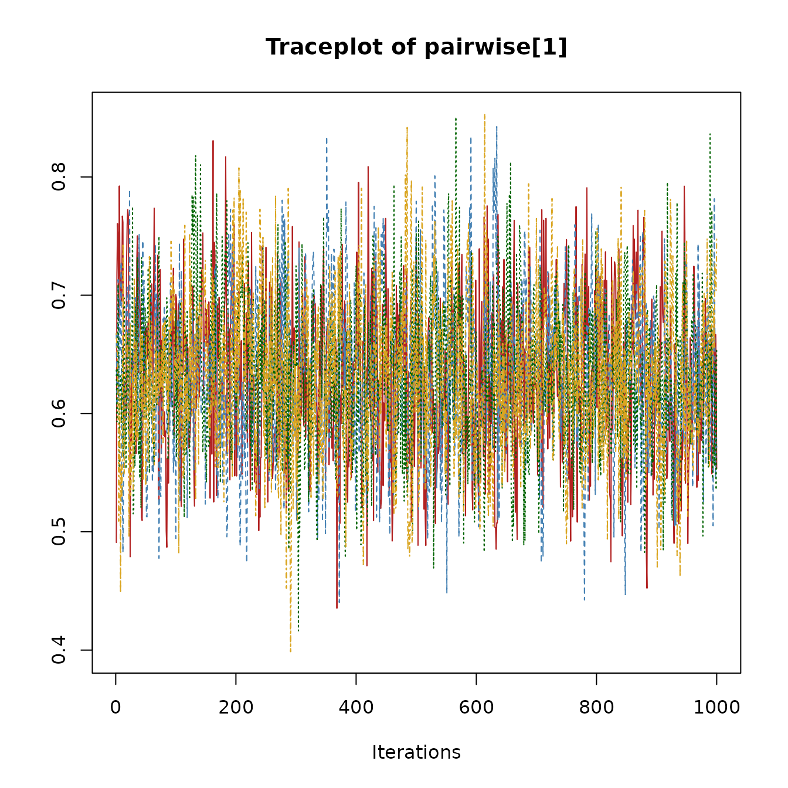

# Diagnostics and Spike-and-Slab Summaries

## Introduction

This vignette illustrates how to inspect convergence diagnostics and how
to interpret spike-and-slab summaries in **bgms** models. For some of
the model variables spike-and-slab priors introduce binary indicator
variables that govern whether the effect is included or not. Their
posterior distributions can be summarized with inclusion probabilities
and Bayes factors.

## Example fit

We use a subset of the Wenchuan dataset:

``` r
library(bgms)
data = Wenchuan[, 1:5]
fit = bgm(data, seed = 1234)
```

## Convergence diagnostics

The quality of the Markov chain can be assessed with common MCMC
diagnostics:

``` r
summary(fit)$pairwise
#>                          mean           sd        mcse     n_eff
#> intrusion-dreams  0.628937007 0.0677606037 0.001202182 3176.9793
#> intrusion-flash   0.337201523 0.0012005272 0.062234287 2687.2957
#> intrusion-upset   0.191010300 0.0756189657 0.006122237  152.5602
#> intrusion-physior 0.198537214 0.0646420624 0.002985072  468.9438
#> dreams-flash      0.499527156 0.0009101115 0.059448942 4266.7685
#> dreams-upset      0.226692666 0.0617080816 0.004555319  183.5044
#> dreams-physior    0.007061984 0.0267717133 0.001145061  546.6324
#> flash-upset       0.008840418 0.0300929122 0.001329300  512.4868
#> flash-physior     0.305169126 0.0010420608 0.053375462 2623.5973
#> upset-physior     0.711333857 0.0011488391 0.059649835 2695.8770
#>                       Rhat
#> intrusion-dreams  1.001266
#> intrusion-flash   1.003259
#> intrusion-upset   1.003553
#> intrusion-physior 1.001431
#> dreams-flash      1.000553
#> dreams-upset      1.004452
#> dreams-physior    1.012091
#> flash-upset       1.017274
#> flash-physior     1.003092
#> upset-physior     1.000396
```

- R-hat values close to 1 (typically below 1.01) suggest convergence
  ([Vehtari et al., 2021](#ref-VehtariEtAl_2021)).
- The effective sample size (ESS) reflects the number of independent
  samples that would provide equivalent precision. Larger ESS values
  indicate more reliable estimates.
- The Monte Carlo standard error (MCSE) measures the additional
  variability introduced by using a finite number of MCMC draws. A small
  MCSE relative to the posterior standard deviation indicates stable
  estimates, whereas a large MCSE suggests that more samples are needed.

Advanced users can inspect traceplots by extracting raw samples and
using external packages such as `coda` or `bayesplot`. Here is an
example using the `coda` package to create a traceplot for a pairwise
effect parameter.

``` r
library(coda)

param_index = 1
chains = lapply(fit$raw_samples$pairwise, function(mat) mat[, param_index])
mcmc_obj = mcmc.list(lapply(chains, mcmc))

traceplot(mcmc_obj,
  col = c("firebrick", "steelblue", "darkgreen", "goldenrod"),
  main = "Traceplot of pairwise[1]"
)
```



## Spike-and-slab summaries

The spike-and-slab prior yields posterior inclusion probabilities for
edges:

``` r
coef(fit)$indicator
#>           intrusion  dreams   flash   upset physior
#> intrusion   0.00000 0.99925 1.00000 0.92975 0.97200
#> dreams      0.99925 0.00000 1.00000 0.98075 0.06675
#> flash       1.00000 1.00000 0.00000 0.08125 1.00000
#> upset       0.92975 0.98075 0.08125 0.00000 1.00000
#> physior     0.97200 0.06675 1.00000 1.00000 0.00000
```

- Values near 1.0: strong evidence the edge is present.
- Values near 0.0: strong evidence the edge is absent.
- Values near 0.5: inconclusive (absence of evidence).

## Bayes factors

When the prior inclusion probability for an edge is equal to 0.5 (e.g.,
using a Bernoulli prior with `inclusion_probability = 0.5` or a
symmetric Beta prior, `main_alpha = main_beta`), we can directly
transform inclusion probabilities into Bayes factors for edge presence
vs absence:

``` r
# Example for one edge
p = coef(fit)$indicator[1, 5]
BF_10 = p / (1 - p)
BF_10
#> [1] 34.71429
```

Here the Bayes factor in favor of inclusion (H1) is small, meaning that
there is little evidence for inclusion. Since the Bayes factor is
transitive, we can use it to express the evidence in favor of exclusion
(H0) as

``` r
1 / BF_10
#> [1] 0.02880658
```

This Bayes factor shows that there is strong evidence for the absence of
a network relation between the variables `intrusion` and `physior`.

## Next steps

- See *Getting Started* for a simple one-sample workflow.
- See *Model Comparison* for group differences.

Vehtari, A., Gelman, A., Simpson, D., Carpenter, B., & Bürkner, P.-C.
(2021). Rank-normalization, folding, and localization: An improved
$\widehat{R}$ for assessing convergence of MCMC. *Bayesian Analysis*,
*16*(2), 667–718. <https://doi.org/10.1214/20-BA1221>
