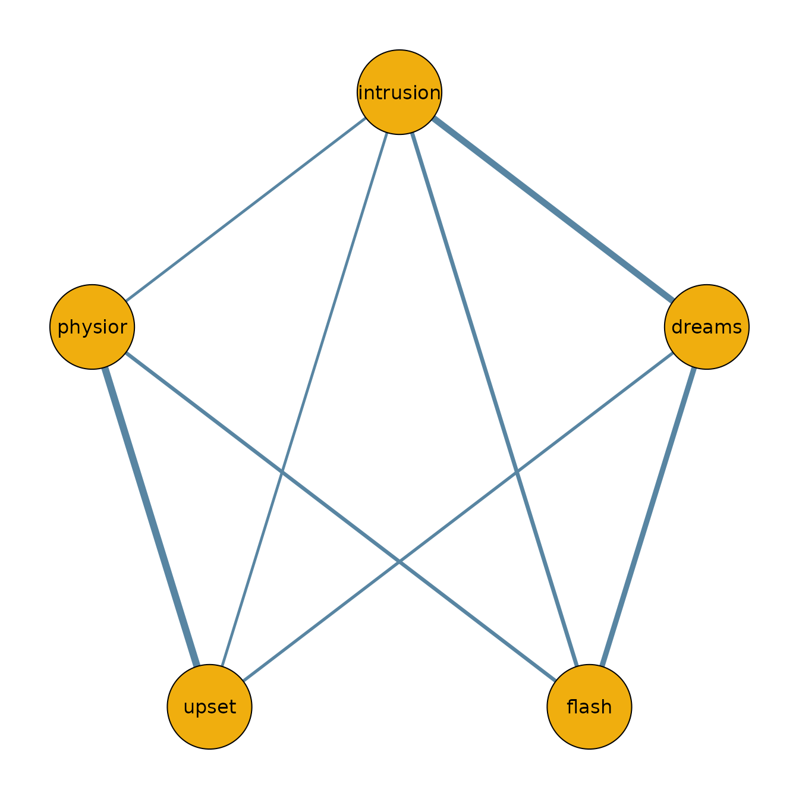

# Getting Started with bgms

## Introduction

The **bgms** package implements Bayesian methods for analyzing graphical
models. It supports three variable types:

- **ordinal** (including binary) — Markov random field (MRF) models,
- **Blume–Capel** — ordinal MRF with a reference category,
- **continuous** — Gaussian graphical models (GGM).

The package estimates main effects and pairwise interactions, with
optional Bayesian edge selection via spike-and-slab priors. It provides
two main entry points:

- [`bgm()`](https://bayesian-graphical-modelling-lab.github.io/bgms/reference/bgm.md)
  for one-sample designs (single network),
- [`bgmCompare()`](https://bayesian-graphical-modelling-lab.github.io/bgms/reference/bgmCompare.md)
  for independent-sample designs (group comparisons).

This vignette walks through the basic workflow for ordinal data. For
continuous data, set `variable_type = "continuous"` in
[`bgm()`](https://bayesian-graphical-modelling-lab.github.io/bgms/reference/bgm.md)
to fit a Gaussian graphical model.

## Wenchuan dataset

The dataset `Wenchuan` contains responses from survivors of the 2008
Wenchuan earthquake on posttraumatic stress items. Here, we analyze a
subset of the first five items as a demonstration.

``` r
library(bgms)

# Analyse a subset of the Wenchuan dataset
?Wenchuan
data = Wenchuan[, 1:5]
head(data)
#>      intrusion dreams flash upset physior
#> [1,]         2      2     2     2       3
#> [2,]         2      2     2     3       3
#> [3,]         2      4     4     4       3
#> [4,]         2      1     2     2       1
#> [5,]         2      2     2     2       2
#> [6,]         4      3     2     2       2
```

## Fitting a model

The main entry point is
[`bgm()`](https://bayesian-graphical-modelling-lab.github.io/bgms/reference/bgm.md)
for single-group models and
[`bgmCompare()`](https://bayesian-graphical-modelling-lab.github.io/bgms/reference/bgmCompare.md)
for multiple-group comparisons.

``` r
fit = bgm(data, seed = 1234)
```

## Posterior summaries

``` r
summary(fit)
#> Posterior summaries from Bayesian estimation:
#> 
#> Category thresholds: 
#>                 mean  mcse    sd    n_eff  Rhat
#> intrusion (1)  0.475 0.007 0.235 1199.616 1.002
#> intrusion (2) -1.908 0.012 0.334  788.430 1.003
#> intrusion (3) -4.861 0.020 0.548  724.535 1.004
#> intrusion (4) -9.545 0.033 0.898  754.681 1.004
#> dreams (1)    -0.590 0.007 0.201  934.188 1.006
#> dreams (2)    -3.782 0.013 0.364  779.761 1.002
#> ... (use `summary(fit)$main` to see full output)
#> 
#> Pairwise interactions:
#>                    mean  mcse    sd    n_eff n_eff_mixt  Rhat
#> intrusion-dreams  0.315 0.001 0.035 1239.708            1.004
#> intrusion-flash   0.170 0.001 0.033 1435.958            1.000
#> intrusion-upset   0.100 0.002 0.034  613.464    188.337 1.031
#> intrusion-physior 0.098 0.003 0.034  172.628    157.685 1.002
#> dreams-flash      0.250 0.001 0.030 1266.225            1.002
#> dreams-upset      0.115 0.001 0.026 1017.363            1.000
#> ... (use `summary(fit)$pairwise` to see full output)
#> Note: NA values are suppressed in the print table. They occur here when an 
#> indicator was zero across all iterations, so mcse/n_eff/n_eff_mixt/Rhat are undefined;
#> `summary(fit)$pairwise` still contains the NA values.
#> 
#> Inclusion probabilities:
#>                    mean  mcse    sd n0->0 n0->1 n1->0 n1->1 n_eff_mixt
#> intrusion-dreams  1.000       0.000     0     0     0  1999           
#> intrusion-flash   1.000       0.000     0     0     0  1999           
#> intrusion-upset   0.973 0.022 0.164    52     3     3  1941     57.707
#> intrusion-physior 0.958 0.025 0.201    79     5     5  1910     64.127
#> dreams-flash      1.000       0.000     0     0     0  1999           
#> dreams-upset      1.000       0.000     0     0     0  1999           
#>                    Rhat
#> intrusion-dreams       
#> intrusion-flash        
#> intrusion-upset   1.319
#> intrusion-physior 1.001
#> dreams-flash           
#> dreams-upset           
#> ... (use `summary(fit)$indicator` to see full output)
#> Note: NA values are suppressed in the print table. They occur when an indicator
#> was constant or had fewer than 5 transitions, so n_eff_mixt is unreliable;
#> `summary(fit)$indicator` still contains all computed values.
#> 
#> Use `summary(fit)$<component>` to access full results.
#> Use `extract_log_odds(fit)` for log odds ratios.
#> See the `easybgm` package for other summary and plotting tools.
```

You can also access posterior means or inclusion probabilities directly:

``` r
coef(fit)
#> $main
#>              cat (1)   cat (2)   cat (3)    cat (4)
#> intrusion  0.4748512 -1.908057 -4.861411  -9.545334
#> dreams    -0.5898472 -3.781793 -7.115825 -11.543035
#> flash     -0.1019984 -2.556490 -5.351775  -9.660627
#> upset      0.4130183 -1.320022 -3.397623  -7.083843
#> physior   -0.6076706 -3.155558 -6.191998 -10.524918
#> 
#> $pairwise
#>            intrusion      dreams       flash       upset     physior
#> intrusion 0.00000000 0.315262872 0.169620044 0.099502069 0.098047855
#> dreams    0.31526287 0.000000000 0.250050075 0.114723866 0.001696487
#> flash     0.16962004 0.250050075 0.000000000 0.003157118 0.153058064
#> upset     0.09950207 0.114723866 0.003157118 0.000000000 0.355353487
#> physior   0.09804786 0.001696487 0.153058064 0.355353487 0.000000000
#> 
#> $indicator
#>           intrusion dreams  flash  upset physior
#> intrusion    0.0000 1.0000 1.0000 0.9725  0.9580
#> dreams       1.0000 0.0000 1.0000 1.0000  0.0415
#> flash        1.0000 1.0000 0.0000 0.0695  1.0000
#> upset        0.9725 1.0000 0.0695 0.0000  1.0000
#> physior      0.9580 0.0415 1.0000 1.0000  0.0000
```

## Network plot

To visualize the network structure, we threshold the posterior inclusion
probabilities at 0.5 and plot the resulting adjacency matrix.

``` r
library(qgraph)

median_probability_network = coef(fit)$pairwise
median_probability_network[coef(fit)$indicator < 0.5] = 0.0

qgraph(median_probability_network,
  theme = "TeamFortress",
  maximum = 1,
  fade = FALSE,
  color = c("#f0ae0e"), vsize = 10, repulsion = .9,
  label.cex = 1, label.scale = "FALSE",
  labels = colnames(data)
)
```



## Continuous data (GGM)

For continuous variables,
[`bgm()`](https://bayesian-graphical-modelling-lab.github.io/bgms/reference/bgm.md)
fits a Gaussian graphical model when `variable_type = "continuous"`. The
workflow is the same:

``` r
fit_ggm = bgm(continuous_data, variable_type = "continuous", seed = 1234)
summary(fit_ggm)
```

The pairwise effects are partial correlations (off-diagonal entries of
the standardized precision matrix). Missing values can be imputed during
sampling with `na_action = "impute"`.

## Next steps

- For comparing groups, see
  [`?bgmCompare`](https://bayesian-graphical-modelling-lab.github.io/bgms/reference/bgmCompare.md)
  or the *Model Comparison* vignette.
- For diagnostics and convergence checks, see the *Diagnostics*
  vignette.
