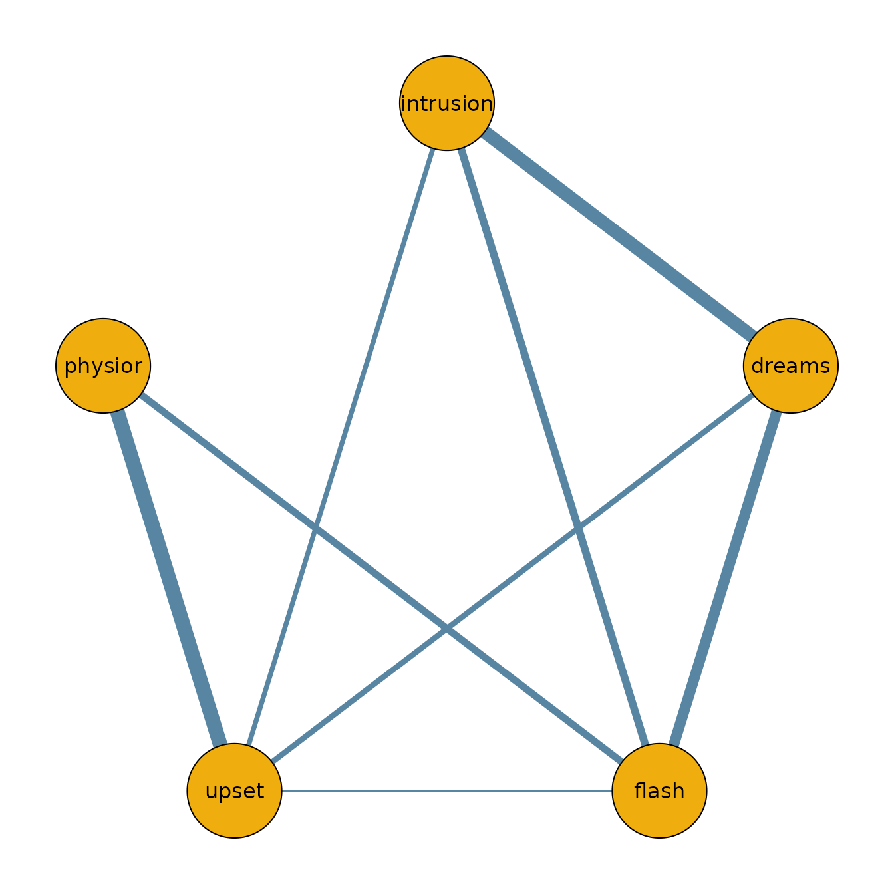

# Getting Started with bgms

## Introduction

The **bgms** package implements Bayesian methods for analyzing graphical
models of binary and ordinal variables. It estimates main effects
(category thresholds) and pairwise interactions in an ordinal Markov
random field (MRF), with optional Bayesian edge selection via
spike–and–slab priors. The package provides two main entry points:

- [`bgm()`](https://bayesian-graphical-modelling-lab.github.io/bgms/reference/bgm.md)
  for one-sample designs (single network),
- [`bgmCompare()`](https://bayesian-graphical-modelling-lab.github.io/bgms/reference/bgmCompare.md)
  for independent-sample designs (group comparisons).

This vignette walks through the basic workflow: fitting a model,
summarizing posterior output, and visualizing results.

## Wenchuan dataset

The dataset `Wenchuan` contains responses from survivors of the 2008
Wenchuan earthquake on posttraumatic stress items. Here, we analyze a
subset of the first five items as a demonstration.

``` r
library(bgms)

# Analyse a subset of the Wenchuan dataset
?Wenchuan
data = Wenchuan[, 1:5]
head(data)
#>      intrusion dreams flash upset physior
#> [1,]         2      2     2     2       3
#> [2,]         2      2     2     3       3
#> [3,]         2      4     4     4       3
#> [4,]         2      1     2     2       1
#> [5,]         2      2     2     2       2
#> [6,]         4      3     2     2       2
```

## Fitting a model

The main entry point is
[`bgm()`](https://bayesian-graphical-modelling-lab.github.io/bgms/reference/bgm.md)
for single-group models and
[`bgmCompare()`](https://bayesian-graphical-modelling-lab.github.io/bgms/reference/bgmCompare.md)
for multiple-group comparisons.

``` r
fit = bgm(data, seed = 1234)
```

## Posterior summaries

``` r
summary(fit)
#> Posterior summaries from Bayesian estimation:
#> 
#> Category thresholds:
#>                 mean  mcse    sd    n_eff  Rhat
#> intrusion (1)  0.485 0.006 0.228 1588.251 1.006
#> intrusion (2) -1.883 0.010 0.331 1117.711 1.012
#> intrusion (3) -4.806 0.019 0.542  796.267 1.012
#> intrusion (4) -9.451 0.030 0.875  854.320 1.013
#> dreams (1)    -0.597 0.005 0.194 1404.284 1.004
#> dreams (2)    -3.802 0.011 0.351 1068.964 1.005
#> ... (use `summary(fit)$main` to see full output)
#> 
#> Pairwise interactions:
#>                    mean    sd  mcse    n_eff  Rhat
#> intrusion-dreams  0.632 0.002 0.066 1568.698 1.004
#> intrusion-flash   0.336 0.001 0.060 1780.162 1.001
#> intrusion-upset   0.189 0.076 0.005  192.188 1.005
#> intrusion-physior 0.195 0.071 0.005  206.922 1.017
#> dreams-flash      0.503 0.002 0.062 1441.550 1.000
#> dreams-upset      0.229 0.061 0.003  403.900 1.007
#> ... (use `summary(fit)$pairwise` to see full output)
#> Note: NA values are suppressed in the print table. They occur here when an 
#> indicator was zero across all iterations, so mcse/n_eff/Rhat are undefined;
#> `summary(fit)$pairwise` still contains the NA values.
#> 
#> Inclusion probabilities:
#>                    mean    sd  mcse n0->0 n0->1 n1->0 n1->1   n_eff
#> intrusion-dreams  1.000 0.000           0     0     0  3999        
#> intrusion-flash   1.000 0.000           0     0     0  3999        
#> intrusion-upset   0.927 0.260 0.025   278    14    14  3693  106.19
#> intrusion-physior 0.949 0.221 0.023   196     9     9  3785  94.741
#> dreams-flash      1.000 0.000           0     0     0  3999        
#> dreams-upset      0.985 0.123  0.01    57     4     4  3934 137.766
#>                    Rhat
#> intrusion-dreams       
#> intrusion-flash        
#> intrusion-upset   1.052
#> intrusion-physior 1.123
#> dreams-flash           
#> dreams-upset      1.162
#> ... (use `summary(fit)$indicator` to see full output)
#> Note: NA values are suppressed in the print table. They occur when an indicator
#> was constant (all 0 or all 1) across all iterations, so sd/mcse/n_eff/Rhat
#> are undefined; `summary(fit)$indicator` still contains the NA values.
#> 
#> Use `summary(fit)$<component>` to access full results.
#> See the `easybgm` package for other summary and plotting tools.
```

You can also access posterior means or inclusion probabilities directly:

``` r
coef(fit)
#> $main
#>              cat (1)   cat (2)   cat (3)    cat (4)
#> intrusion  0.4848853 -1.883467 -4.806016  -9.451198
#> dreams    -0.5965478 -3.801521 -7.133627 -11.583398
#> flash     -0.1072322 -2.570423 -5.380047  -9.695791
#> upset      0.4224335 -1.297832 -3.366620  -7.029605
#> physior   -0.6101686 -3.158835 -6.201602 -10.539855
#> 
#> $pairwise
#>           intrusion      dreams       flash       upset     physior
#> intrusion 0.0000000 0.632293951 0.335941200 0.189497746 0.194802150
#> dreams    0.6322940 0.000000000 0.502768076 0.228964481 0.003975021
#> flash     0.3359412 0.502768076 0.000000000 0.009480741 0.307821055
#> upset     0.1894977 0.228964481 0.009480741 0.000000000 0.710876259
#> physior   0.1948022 0.003975021 0.307821055 0.710876259 0.000000000
#> 
#> $indicator
#>           intrusion  dreams   flash   upset physior
#> intrusion   0.00000 1.00000 1.00000 0.92700 0.94875
#> dreams      1.00000 0.00000 1.00000 0.98475 0.04975
#> flash       1.00000 1.00000 0.00000 0.08775 1.00000
#> upset       0.92700 0.98475 0.08775 0.00000 1.00000
#> physior     0.94875 0.04975 1.00000 1.00000 0.00000
```

## Network plot

To visualize the network structure, we threshold the posterior inclusion
probabilities at 0.5 and plot the resulting adjacency matrix.

``` r
library(qgraph)

median_probability_network = coef(fit)$pairwise
median_probability_network[coef(fit)$indicator < 0.5] = 0.0

qgraph(median_probability_network,
  theme = "TeamFortress",
  maximum = 1,
  fade = FALSE,
  color = c("#f0ae0e"), vsize = 10, repulsion = .9,
  label.cex = 1, label.scale = "FALSE",
  labels = colnames(data)
)
```



## Next steps

- For comparing groups, see
  [`?bgmCompare`](https://bayesian-graphical-modelling-lab.github.io/bgms/reference/bgmCompare.md)
  or the *Model Comparison* vignette.
- For diagnostics and convergence checks, see the *Diagnostics*
  vignette.
